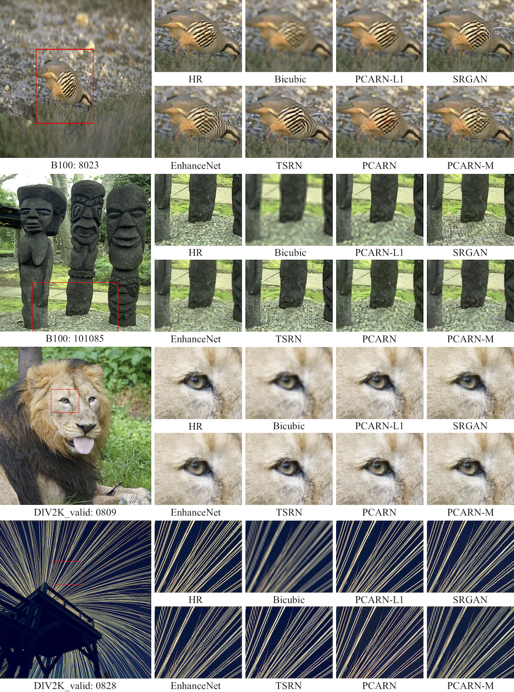

# Efficient Deep Neural Network for Photo-realistic Image Super-Resolution
Namhyuk Ahn, Byungkon Kang, Kyung-Ah Sohn. [[arXiv](https://arxiv.org/abs/1903.02240)]

## Requirements
- Python 3
- [PyTorch](https://github.com/pytorch/pytorch) (1.0.0), [torchvision](https://github.com/pytorch/vision)
- Numpy, Scipy
- Pillow, Scikit-image
- h5py
- importlib
- [PerceptualSimilarity](https://github.com/richzhang/PerceptualSimilarity)

## Dataset
We use the same protocols of CARN, our prior work. Please see the details on this [repo](https://github.com/nmhkahn/CARN-pytorch#dataset).

## Test Pretrained Models
We provide the pretrained models in the `checkpoints` directory. To test the PCARN on benchmark dataset:
```shell
# For PCARN and PCARN (L1)
$ python pcarn/inference.py \
    --model pcarn \
    --ckpt ./checkpoints/<path>.pth \
    --data ./dataset/<dataset> \
    --scale [2|3|4] \
    --sample_dir <sample_dir>

# For PCARN-M and PCARN-M (L1)
$ python pcarn/inference.py \
    --model pcarn \
    --ckpt ./checkpoints/<path>.pth \
    --data ./dataset/<dataset> \
    --scale [2|3|4] \
    --sample_dir <sample_dir> \
    --mobile --group 4
```
We provide our results on four benchmark dataset (Set5, Set14, B100 and Urban100). [Google Drive](https://drive.google.com/open?id=1mWBRZyClsZOnyHdcMGDrM2rnkXEdBQHU)

### Training Models
Before train the PCARN(-M), models have to be pretrained with L1 loss.
```shell
# For PCARN (L1)
python pcarn/main.py \
    --model pcarn \
    --ckpt_dir ./checkpoints/<save_directory> \
    --batch_size 64 --patch_size 48 \
    --scale 0 --max_steps 600000 --decay 400000 \
    --memo <message_shown_in_logfile>

# For PCARN-M (L1)
python pcarn/main.py \
    --model pcarn \
    --ckpt_dir ./checkpoints/<save_directory> \
    --mobile --group 4 \
    --batch_size 64 --patch_size 48 \
    --scale 0 --max_steps 600000 --decay 400000 \
    --memo <message_shown_in_logfile>
```

Train the PCARN(-M) using below commands. Note that [PerceptualSimilarity](https://github.com/richzhang/PerceptualSimilarity) has to be ready to evaluate the model performance during training.
```
# For PCARN
python pcarn/main.py \
    --model pcarn \
    --ckpt_dir ./checkpoints/<save_directory> \
    --perceptual --msd \
    --pretrained_ckpt <pretrained_model_path> \
    --batch_size 32 --patch_size 48 \
    --scale 0 --max_steps 600000 --decay 400000 \
    --memo <message_shown_in_logfile>
    
# For PCARN-M
python pcarn/main.py \
    --model pcarn \
    --ckpt_dir ./checkpoints/<save_directory> \
    --perceptual --msd \
    --pretrained_ckpt <pretrained_model_path> \
    --mobile --group 4 \
    --batch_size 32 --patch_size 48 \
    --scale 0 --max_steps 600000 --decay 400000 \
    --memo <message_shown_in_logfile>
```

## Results


## Citation
```
@article{ahn2019efficient,
  title={Efficient Deep Neural Network for Photo-realistic Image Super-Resolution},
  author={Ahn, Namhyuk and Kang, Byungkon and Sohn, Kyung-Ah},
  journal={arXiv preprint arXiv:1903.02240},
  year={2019}
}
```
